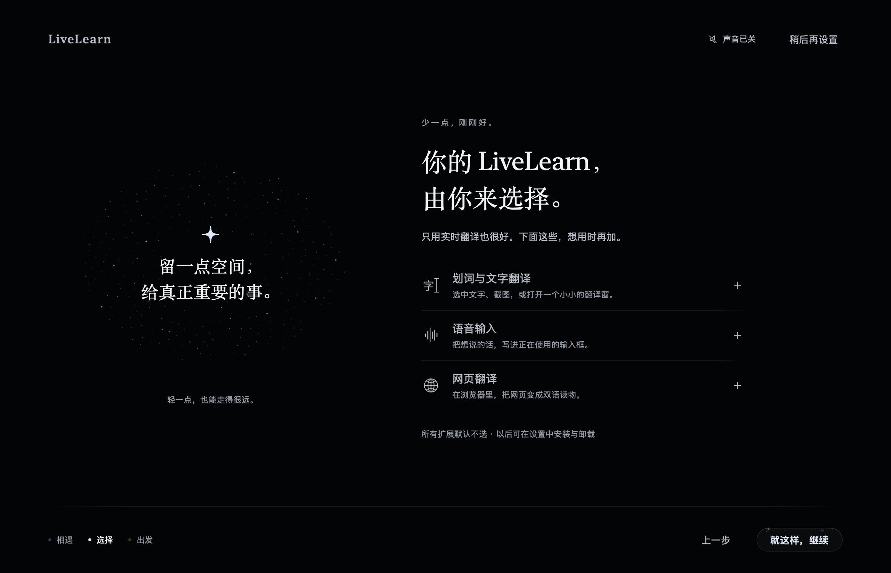

<div align="center">

# LiveLearn

**让每一句话，都离你近一点。**

macOS 实时翻译与双语字幕。默认轻装上阵，需要什么，再添什么。

[下载与版本](https://github.com/fantay0312/LiveLearn/releases) · [反馈问题](https://github.com/fantay0312/LiveLearn/issues) · [GPL-3.0](LICENSE)

</div>


## 一件事，认真做好

看一堂外语课，听一段访谈，或进行一次跨语言交流。LiveLearn 把你选择的电脑声音、应用声音或麦克风转成字幕，再翻译成你需要的语言。

核心安装包包含实时翻译、字幕浮层、会话记录与词汇功能。划词翻译、语音输入和网页翻译是可选模块：首次引导全部默认不勾选，以后也能在 **设置 → 功能管理** 中下载、停用或卸载。

当前 0.1.0 Apple Silicon 核心包实测：**下载约 13.8 MiB，解压约 30.2 MiB**。可选模块和后续下载的模型不计入这两个数字。

这是早期开发版本。当前发布包面向 Apple Silicon，采用本地 ad-hoc 签名，尚未完成 Apple Developer ID 签名与公证。请在使用前确认版本说明；源码构建入口与验证方法见下文。

## 能做什么

| 能力 | 核心安装包 | 使用方式 |
| --- | --- | --- |
| 实时语音识别与翻译 | 包含 | 选择电脑声音、指定应用或麦克风，配置语言与引擎后开始 |
| 双语字幕浮层 | 包含 | 分层显示或静止的单行字幕；支持字号、位置、背景与锁定 |
| 会话与导出 | 包含 | 按需保存记录，导出 TXT、Markdown、SRT、VTT |
| 词汇 | 包含 | 管理词汇与替换规则，配合识别和翻译使用 |
| 划词、文字与截图翻译 | 可选下载 | 基于 Easydict，保留独立服务配置与原生设置 |
| 语音输入 | 可选下载 | 在输入框中听写，可配置识别引擎和完成后的纠错 |
| 网页翻译 | 可选下载 | 基于 Read Frog，下载后在 Chromium 浏览器中手动加载 |

主程序保留轻量的模块入口和共享识别代码；文字翻译程序、设置组件、额外听写运行时、浏览器扩展及其源码包不进入默认核心包。模型权重也不预装。

## 开始使用

1. 从 [Releases](https://github.com/fantay0312/LiveLearn/releases) 获取核心应用，或从源码构建。
2. 完成三步引导。只需要实时翻译时，保持所有扩展未勾选即可。引导中的声音默认关闭。
3. 在首页选择音源与语言。在 **设置 → 引擎** 中选择识别和翻译服务；本机模型在 **本地模型** 页面按需下载。
4. 开始会话。macOS 会在实际需要时请求相关权限。

**权限按用途申请。** 电脑声音使用系统音频采集权限；麦克风只在启用麦克风音源时使用。语音输入向其他应用写入文字时需要辅助功能权限。完成引导本身不会开始录音。

**引擎由你选择。** 支持系统本机能力、WhisperKit，以及项目中提供的云端或本地兼容服务适配器。Apple SpeechAnalyzer 需要 macOS 26 或更高版本；其他引擎是否可用，取决于系统版本、模型、账户和服务能力。云端服务需使用自己的有效配置，可能产生服务费用。

## 按需添加模块



进入 **设置 → 功能管理**，点击对应模块的「下载并安装」。下载来自本仓库的 GitHub Releases。客户端先验证内置公钥对应的目录签名，再检查下载大小、SHA-256、归档路径及原生代码签名；文件验证完成后才启用模块。

- **文字翻译：** 同时下载翻译程序和设置组件。已加载设置组件后，如需卸载，先停用并重启应用。
- **语音输入：** 可使用共享的本机和云端识别引擎。附加协议运行时不包含服务授权、账户令牌或第三方输入法应用；特定服务需要自行提供有效配置。当前运行时要求 macOS 26。
- **网页翻译：** 下载完成不等于浏览器已启用。打开「网页翻译」设置，准备文件，再按页面说明加载到 Chrome、Edge、Brave、Arc 或 Chromium。当前安装路径不包含 Safari 与 Firefox。

模块文件位于 `~/Library/Application Support/LiveLearn/Modules/`。下载可取消，失败可重试；不影响已安装的核心实时翻译。卸载保留个人偏好、词汇和凭据。浏览器已经加载的扩展需在浏览器内单独移除。

## 数据与隐私

- 本机引擎在本机处理相应阶段；下载模型时仍需连接模型来源。
- 选择云端识别后，音频会发送到所选服务；选择云端翻译或纠错后，相应文字会发送到所选服务。
- 字幕、文字翻译与浏览器扩展使用各自的引擎配置。更改一处不会自动切换其他模块的服务。
- 主程序服务凭据使用 macOS 钥匙串。文字翻译和浏览器扩展沿用各自配置存储方式。
- 会话是否保存由设置决定。不要把日志、诊断包、真实录音或个人服务配置直接提交到公开 Issue。
- 模块下载需要访问 GitHub；没有默认后台安装扩展的行为。

## 从源码构建

需要 macOS、完整 Xcode，以及支持 Swift 6 和 macOS 26 API 的 SDK。核心应用部署目标为 macOS 15；本机 SpeechAnalyzer 仍需要 macOS 26。首次 SwiftPM 构建需要联网获取锁定依赖。

```sh
git clone https://github.com/fantay0312/LiveLearn.git
cd LiveLearn
zsh script/build_and_run.sh
```

该入口构建核心应用、组装真实 `.app`、本地签名并启动。不要用裸 `swift run` 代替正常 GUI 运行，它不能替代应用包的权限与窗口行为。

```sh
# Release 核心包，不启动
zsh script/build_and_run.sh --release --no-launch

# 相关行为测试
swift test --filter 'OptionalModuleTests|SettingsModeTests|UnifiedSettingsTests|SettingsModalHostTests'

# 全部 SwiftPM 测试
swift test
```

产物位于 `build/LiveLearn.app`。某些现有原生渲染测试依赖前台窗口与图形环境，不应把无界面环境的跳过当作界面验收。

### 构建可选模块

```sh
zsh script/build_translation.sh --release
zsh script/build_dictation.sh
zsh script/build_chatterfly.sh
zsh script/build_browser_extension.sh
python3 script/package_modules.py --version 0.1.0 --tag modules-v1
```

文字翻译构建还需要 Python 3，使用仓库中固定版本的 Easydict 源码和依赖；语音运行时需要 `pkg-config`、Opus 和 macOS 26 SDK；浏览器扩展使用其 `package.json` 声明的 Node.js / pnpm 版本与锁文件。默认核心构建不会调用这些步骤。

`package_modules.py` 输出模块压缩包与未签名目录。发布者使用 `script/module_signing.swift` 和保存在仓库之外的私钥签名目录；自建发行版需使用自己的公钥和下载地址，并同步修改 `ModuleInstaller.repository` 的仓库标识。**私钥不应进入 Git。** 目录签名用于验证模块来源，不能替代 Apple 的 Developer ID 签名或公证。

## 项目结构

```text
Sources/
  LiveLearnApp/        原生界面、字幕、引导、模块管理
  AudioDomain/        音频数据与边界
  CaptionDomain/      字幕合并与状态
  EngineKit/          识别和翻译契约
  LocalEngine/        Apple 本机能力
  WhisperEngine/      WhisperKit 与按需模型
  CloudEngine/        网络服务适配器
  SessionDomain/      会话协调
  SessionStorage/     记录与导出
Vendor/               固定版本依赖、模块源码与原始许可证
Tests/                行为、数据与界面契约测试
script/               构建、打包与验证入口
```

`doc/`、`build/`、`.build/`、临时目录、缓存、本机代理配置及凭据文件均不纳入 Git。私有研究材料不属于公开仓库的构建依赖。

## 贡献与许可

欢迎提交能复现的问题、改进建议和 Pull Request。涉及音源、语言、引擎或权限的问题，请附上系统版本、芯片、所选引擎和最小复现步骤，并删去个人数据。

LiveLearn 使用 **[GNU GPL v3](LICENSE)**：允许使用、修改、分发和商用；分发适用作品时需遵守 GPL 的源码提供、许可证与通知等要求。项目不额外要求商业使用授权。

Easydict、Read Frog、ThinkingOrbsKit、WhisperKit、ZIPFoundation、Opus 及场景素材保留各自许可证与署名。详见 [第三方说明](THIRD_PARTY_NOTICES.md)。感谢这些项目让 LiveLearn 成为可能。
